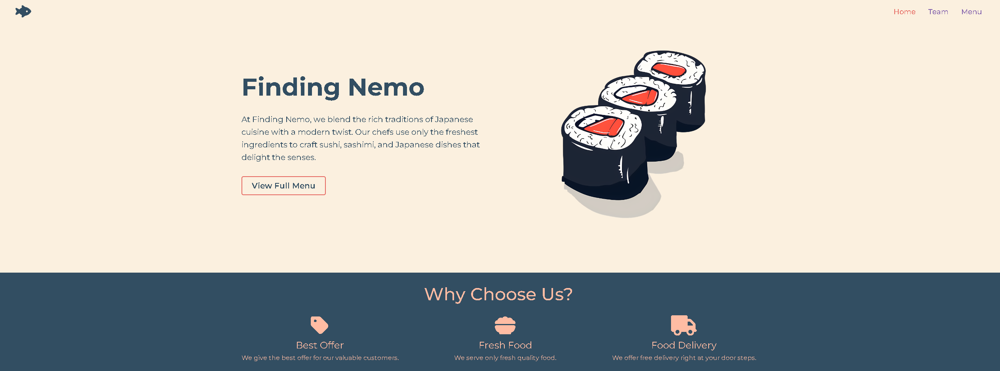

# desn3035-assignment-3

**Finding Nemo** is a modern, responsive website built with **Next.js** for a restaurant specializing in Japanese cuisine, particularly sushi.

You can visit the site at [FindingNemo](https://c-victorino.github.io/desn3035-a3/)

## Prerequisites

Make sure you have the following installed:

- Node.js (LTS version)
- npm (comes with Node.js)
- Git (optional, required if cloning the repository)

## Installation & Setup

1. Clone the Repository
   First, clone the repository from GitHub:

```sh
git clone https://github.com/c-victorino/desn3035-a3.git
cd  repo-name
```

2. Install Dependencies
   Ensure you have Node.js and npm installed.
   Run the following command to install the required dependencies:

```sh
   npm install
```

3. Start the Development Server
   To run the project locally, use the following command:

```sh
   npm run dev
```

4. By default, the project will be available at:

```sh
   http://localhost:3000
```

## Folder Structure

The main project directory contains the following folders and files:

- `/app`: Contains the core app logic:

  - `/components`: Reusable components that can be imported and used across different pages.
  - `/data`: Contains json files related to the page data.
  - `layout.jsx`: Defines the layout structure of the app.
  - `page.jsx`: The main entry point for the app.

- `/public`: Static files such as images, fonts, and other assets.
- `/styles`: Global css styles for the app
